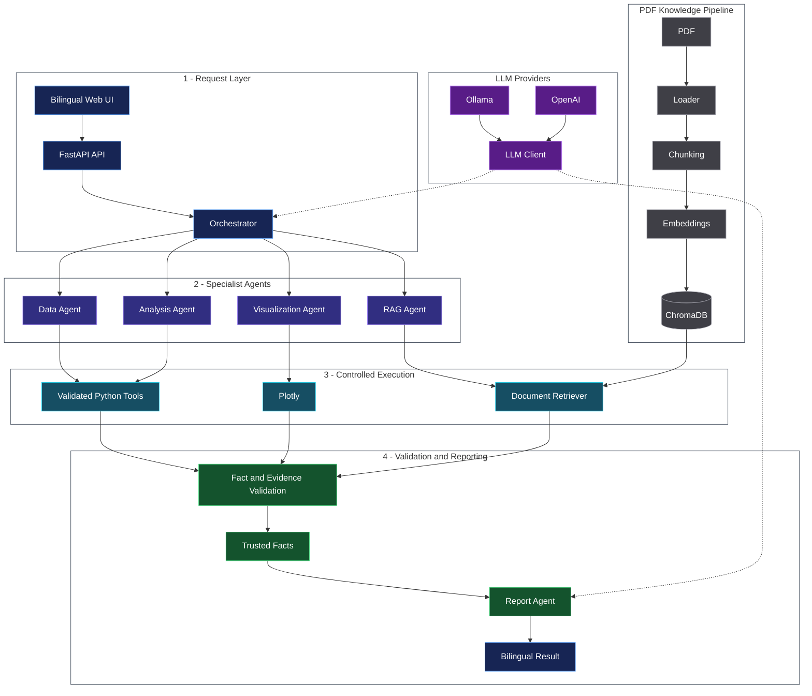

# DataMind AI

DataMind AI is a bilingual, multi-agent data-analysis platform. It combines
deterministic Python tools with a locally hosted or cloud LLM to inspect
datasets, calculate statistics, create interactive charts, retrieve evidence
from PDF documents, and produce grounded analytical reports.


## Highlights

- Arabic and English responsive interface with RTL/LTR support
- Secure CSV and Excel upload with deterministic quality profiling
- Multi-agent orchestration for data, analysis, visualization, RAG, and reports
- Typed, allowlisted Pandas tools instead of arbitrary model-generated code
- Interactive Plotly visualizations
- PDF ingestion, chunking, embeddings, ChromaDB retrieval, and citations
- Fact-grounded reports that separate findings, interpretations, and advice
- Structured LLM output validated with Pydantic
- Local, private inference with Ollama; OpenAI is an optional provider
- Automated tests and Ruff linting

## Architecture



The request flows through specialized agents and controlled tools. Retrieved evidence and calculated results are validated before the bilingual report is generated.

## Technology stack

- Python 3.11+
- FastAPI and Pydantic
- Pandas and Plotly
- Ollama or OpenAI
- Sentence Transformers and ChromaDB
- HTML, CSS, and vanilla JavaScript
- Pytest and Ruff

## Local setup

### 1. Clone and create the environment

```powershell
git clone https://github.com/ShathaMoeen/datamind-ai.git
cd datamind-ai
python -m venv .venv
Set-ExecutionPolicy -Scope Process -ExecutionPolicy RemoteSigned
.\.venv\Scripts\Activate.ps1
python -m pip install -e ".[dev]"
```

### 2. Configure the application

```powershell
Copy-Item .env.example .env
```

The default configuration uses Ollama locally and does not require a paid API
key. Never commit the generated `.env` file.

### 3. Install and prepare Ollama

Install Ollama, then download the configured model:

```powershell
ollama pull qwen3:1.7b
```

### 4. Start DataMind AI

```powershell
fastapi dev app/main.py
```

Open <http://127.0.0.1:8000>. Interactive API documentation is available at
<http://127.0.0.1:8000/docs>.

## Example questions

```text
Analyze monthly_income, monthly_expenses, and monthly_savings. Show the key
figures, create an appropriate chart, and provide three concise recommendations.
```

```text
قارن متوسط monthly_savings حسب region، وحدد أفضل وأسوأ منطقة، ثم أنشئ رسمًا
عموديًا وقدّم ثلاث توصيات مختصرة.
```

## API endpoints

| Method | Endpoint | Purpose |
| --- | --- | --- |
| `GET` | `/api/v1/health` | Service health check |
| `POST` | `/api/v1/datasets/upload` | Upload CSV/XLSX data |
| `GET` | `/api/v1/datasets/{id}/profile` | Inspect dataset quality |
| `POST` | `/api/v1/documents/upload` | Upload a supporting PDF |
| `POST` | `/api/v1/analysis/run` | Run the multi-agent workflow |

## Quality checks

```powershell
python -m pytest
python -m ruff check .
```

## Safety and privacy

- `.env`, uploaded datasets, documents, vector stores, and virtual environments
  are excluded from Git.
- Dataset computations run through typed, allowlisted functions.
- Retrieved document text is treated as untrusted input.
- Report references are validated against trusted workflow facts.
- Local Ollama inference keeps prompts on the user's machine.

## Current limitations

- The lightweight local model may be slower and less fluent than hosted models.
- The application is currently intended for local development and portfolio use.
- Generated recommendations are analytical assistance, not financial advice.

## Author

Built by **Shatha Jadalhaq** as a portfolio project demonstrating applied AI,
multi-agent orchestration, RAG, backend engineering, and data visualization.
